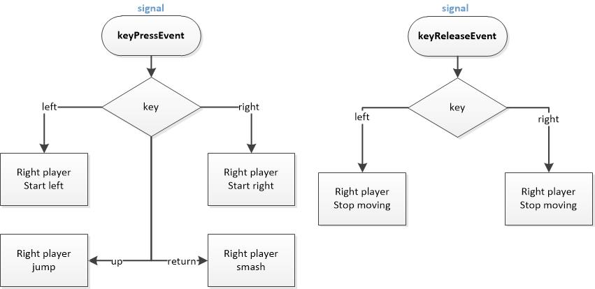
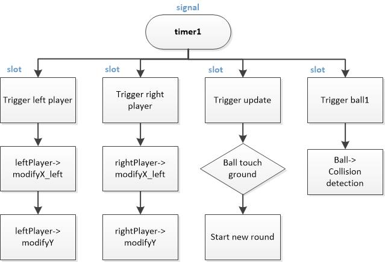
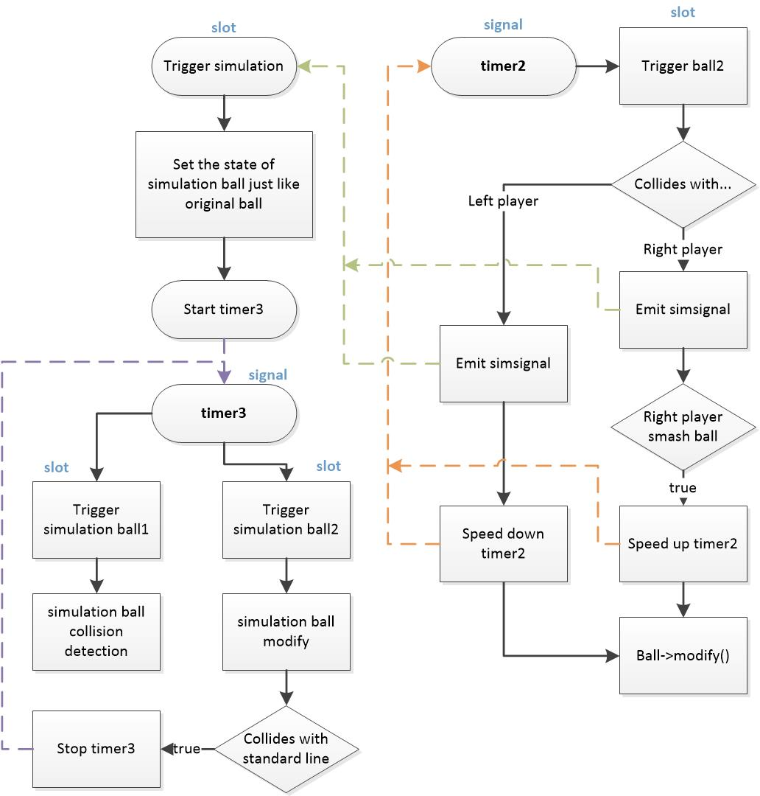
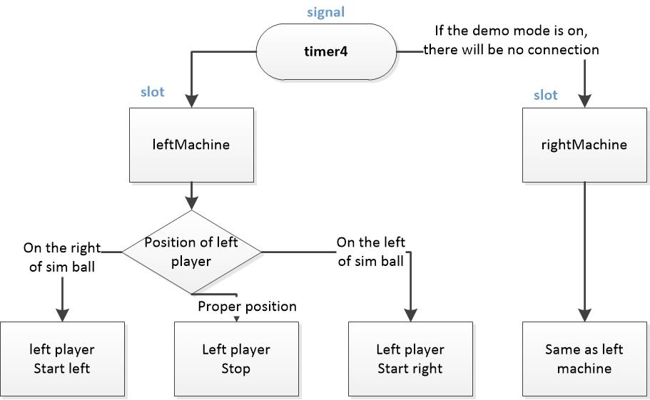

# Pikachu volleyball
A Pikachu volleyball written in c++ and qt5 GUI.

- How to compile and run in cygwin
```
$ startxwin
$ export DISPLAY=:0.0
$ make
$ make clean 
$ ./project.exe 
```

- How to play
  - Select the checkboxes depends on whether you want "music", "sound", "demo mode" or not.
  - Click **START** to start the game.
  - Using **UP**, **LEFT**, **RIGHT** keys to control the move of the Pikachu.
  - The corresponding scores will be shown on two sides of the window.
  

- How it works



